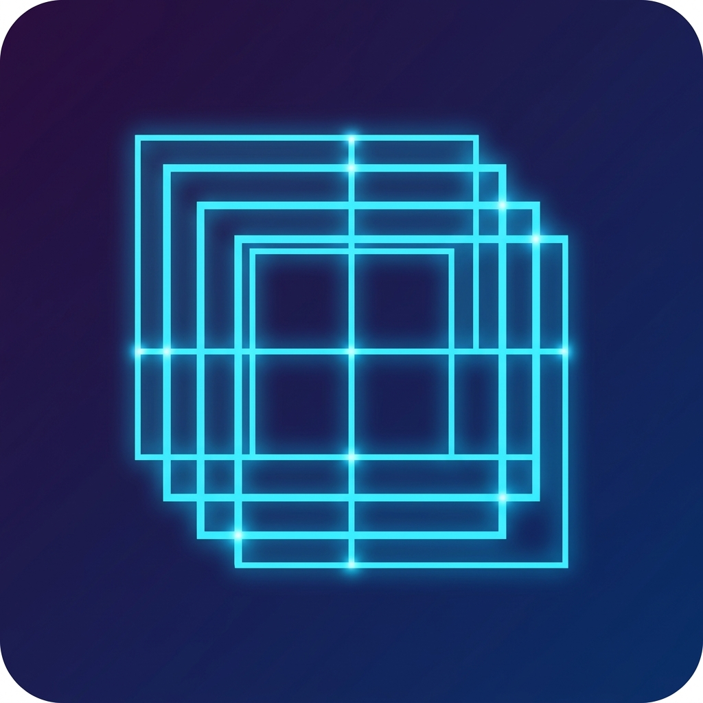

# Caelestia UI



A beautiful, high-performance, and interactive tiling window manager overlay for Windows.

## Installation & Running

To install and run Caelestia UI, open your PowerShell or Command Prompt and run:

```powershell
git clone https://github.com/rajsriv/hyprland-for-win.git
cd hyprland-for-win
pip install .
caelestia
```

For development and real-time updates of the source files, install in editable mode instead:

```powershell
pip install -e .
```

## Running in the Background (Close Terminal)

If you want to keep the application running even after you close your terminal window, start it using one of the following commands:

### PowerShell
```powershell
Start-Process caelestia -WindowStyle Hidden
```

### Command Prompt (CMD)
```cmd
start pythonw -m caelestia.main
```

### How to Stop
- **System Tray**: Right-click the computer icon in the Windows System Tray (bottom-right taskbar area) and choose **Exit Caelestia UI**.
- **Terminal command**:
  ```powershell
  Stop-Process -Name "caelestia" -Force
  ```

## Autostart on Boot

To automatically start Caelestia UI silently when Windows boots up, you can enable/disable the autostart feature using the following terminal commands:

- **Activate Autostart**:
  ```powershell
  caelestia --autostart
  ```
  *(Creates a startup script that runs Caelestia silently in the background on login.)*

- **Deactivate Autostart**:
  ```powershell
  caelestia --no-autostart
  ```
  *(Removes the startup script from the Windows Startup folder.)*


## Features
- **Fibonacci Dwindle Tiling**: Automatically tiles resizable windows.
- **Dynamic Taskbar & Waybar Spacing**: Automatically leaves gaps for taskbars (including auto-hidden taskbars) and docked panels (such as Yasb, PowerToys, or our own topbar).
- **Global Win+F Shortcut**: Toggles the active window to fullscreen (released from tiling) and throws it back into tiling when pressed again.
- **System Tray Icon**: Context menu controls for toggling screen margins and switching Top Bar light/dark themes.
